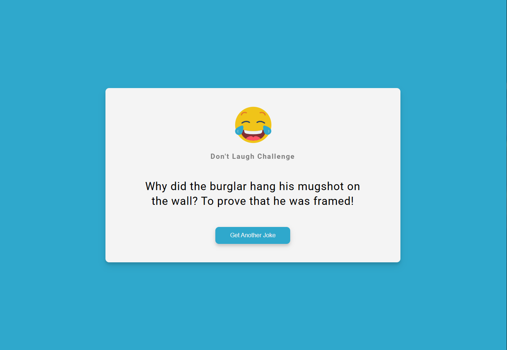

# Random Joke Generator



### [DEMO](https://devjames3.github.io/Random-Joke-App/)

This is a fun and interactive app that generates a random joke every time you click the button. Built with HTML, CSS, and Vanilla JavaScript, it showcases event handling and API integration.

## Features

- Fetches and displays a random joke with a single click.
- Interactive button to trigger new jokes.
- Simple and clean user interface for a delightful experience.

## Usage

1. Clone the repository:

   ```bash
   git clone https://github.com/devJames1/random-joke-generator.git
   ```

2. Navigate to the project directory and open the `index.html` file in your browser.

3. Click the "Get a Joke" button to see a random joke.

## Example

When you click the "Get a Joke" button, you might see a joke like:

> **Why don’t skeletons fight each other?**  
> They don’t have the guts!

Each click fetches a new joke for endless laughter.

## Credits

- Jokes are fetched from [Official Joke API](https://icanhazdadjoke.com) or another public jokes API.
- Thanks to online resources and tutorials for inspiration and design ideas.

## Contributing

Contributions are welcome! If you have ideas to enhance this project, feel free to fork the repository and submit a pull request. Please follow the existing code style and include documentation for new features.

## Author

James Okolie

## License

This project is licensed under the [MIT License](LICENSE).
